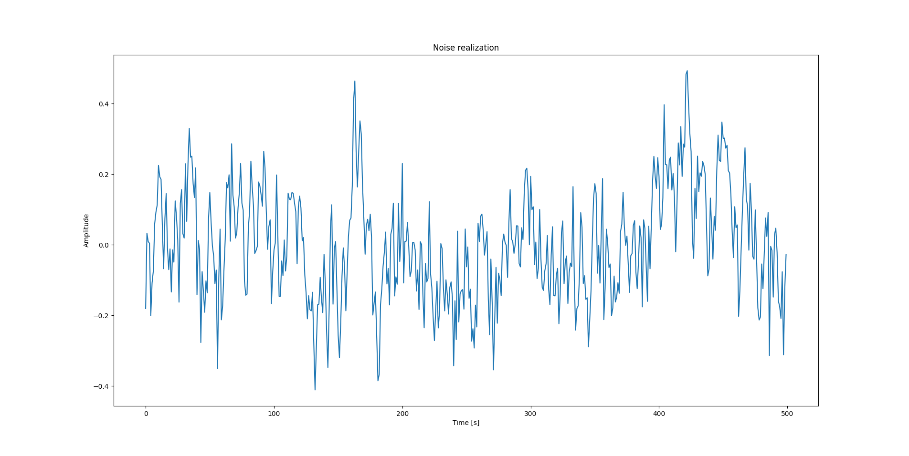
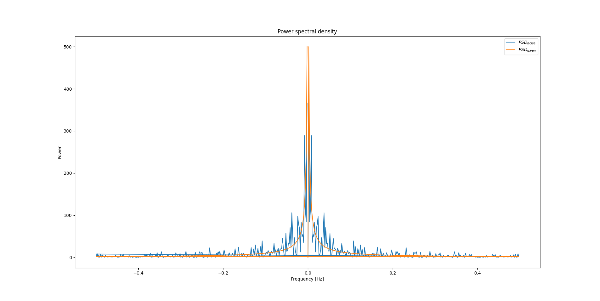
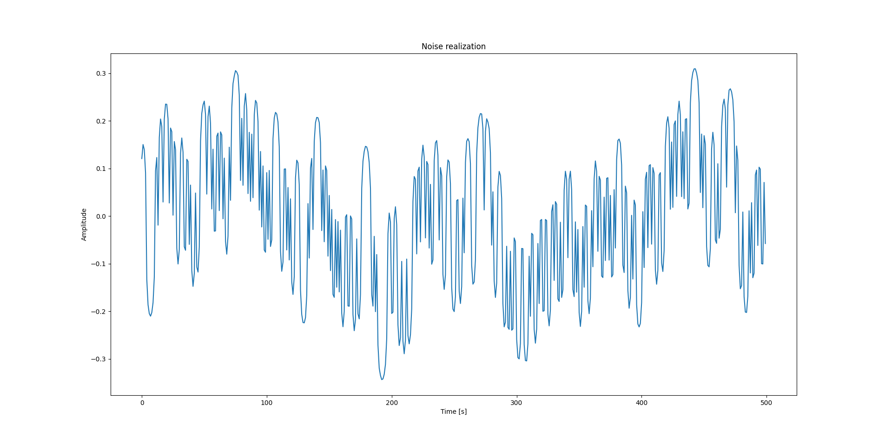
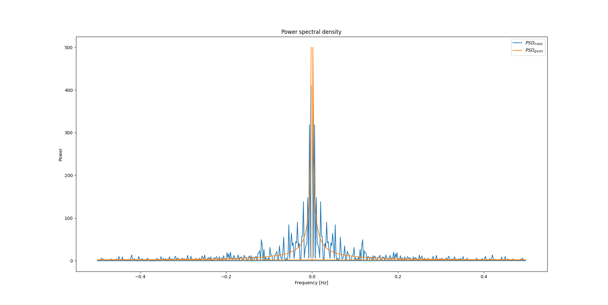

# Noise generator

## Description
Creating a stationary mean free process, where you can determine the sampling distribution and power spectral density (psd).

## Function
Creating white noise with desired sampling distribution. Then fitting the desired psd to the noise.

## Usage
'''
noise(n_samples, psd, distribution)
'''
  **Parameters:**
    n_samples:    number of sampels 
    psd:          psd of noise with maximal frequency the nyquist frequency
                  sampled frequencies: freq = np.fft.fftfreq(n_samples, 1 /f_s)
                  f_s -> samling frequency
    distribution: choose how to sample white noise
                  possible "uniform" distribution (0 till 1), 
                  "binominial" distribution (x_1 = 1, x_2 = -1),
                  "gauss" distribution, default "gauss" distribution   
  **Retruns:**
                  noise samples

## Example

